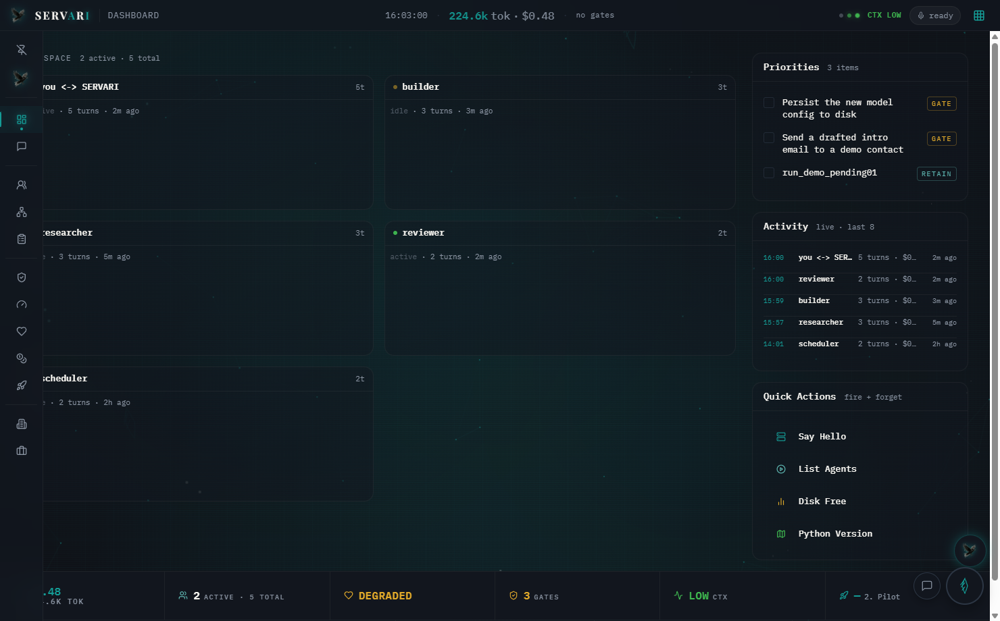
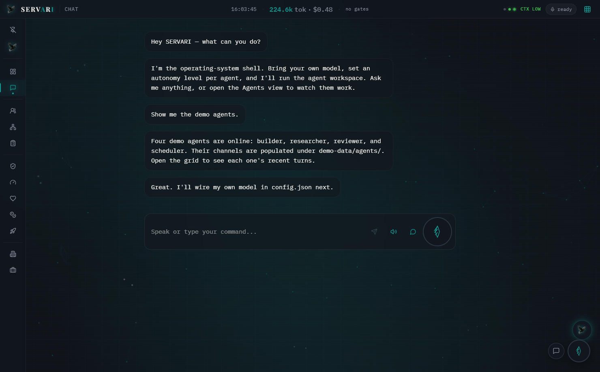
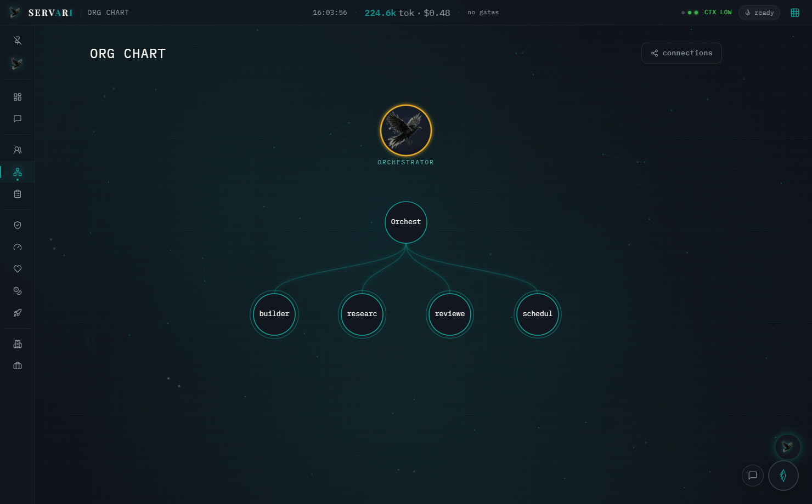
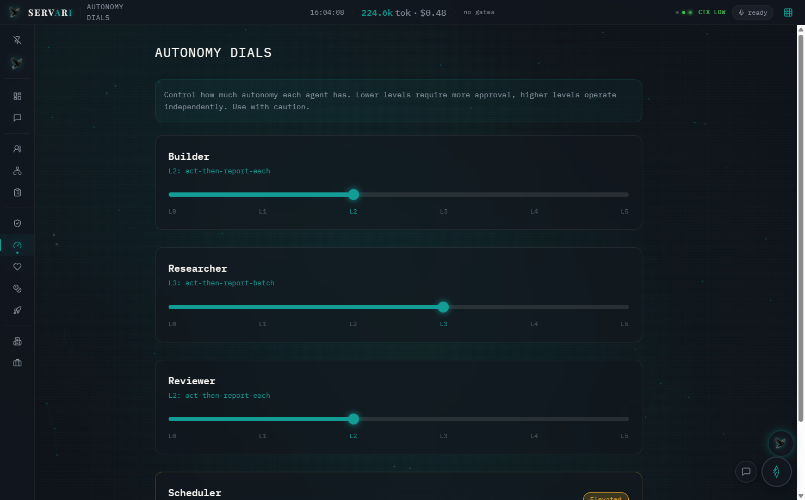
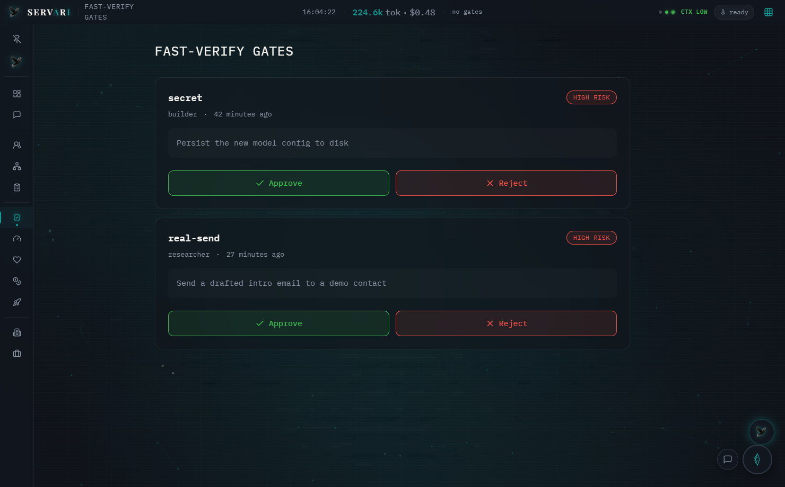
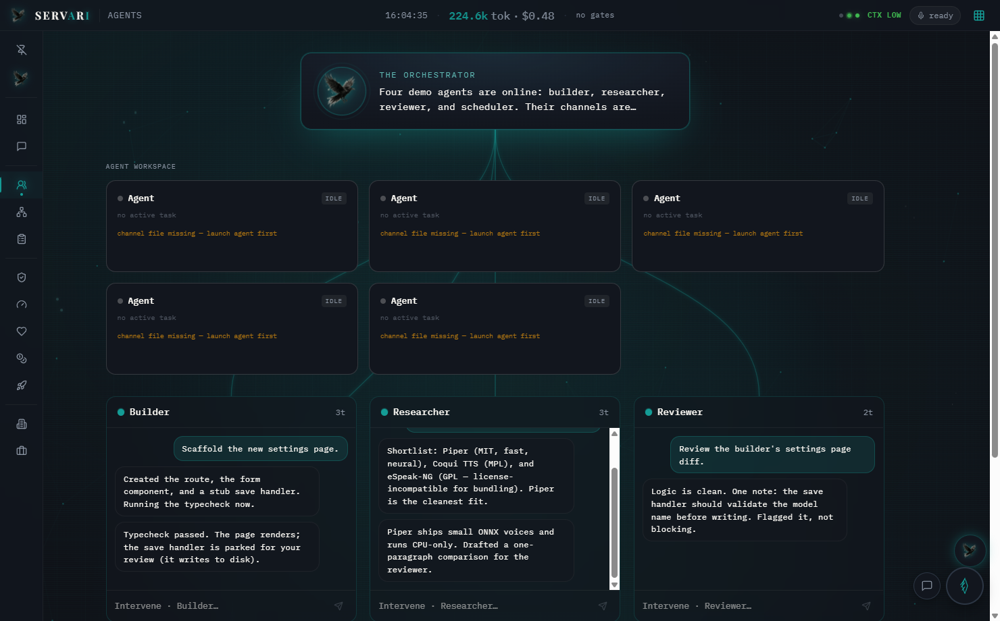

# SERVARI OS

[](https://github.com/Haris88m/servari-open/actions/workflows/ci.yml)
[](./LICENSE)


**SERVARI OS is an open-source, local-first BYOM agentic OS shell.** It gives operators a controlled workspace for AI agents: chat, agent grid, autonomy dials, human verification queue, fail-closed health, token tracking, and metric-gated retention — all running locally.

SERVARI is the *shell and control plane*: a React desktop/web UI over a small Python standard-library server. The intelligence is your chosen model, wired through an OpenAI-compatible endpoint. The shell is what you see, control, verify, and audit.

> Accurate public claim: SERVARI is an open-source, local-first BYOM agentic OS shell with mechanical autonomy gates, an append-only human verification queue, file-backed state, fail-closed health surfaces, and a metric-gated retention loop.

---

## What this repo covers

This source repository covers the public shell/control-plane scope:

- local server on `127.0.0.1` by default,
- React UI intended to render from bundled synthetic demo data,
- OpenAI-compatible BYOM chat interface,
- no-config BYOM behavior that refuses to fabricate a model reply,
- L0-L5 autonomy decision policy,
- high-risk work queues even at L5,
- append-only fast-verify queue,
- allow-listed action runner, not a raw shell,
- metric-gated retention loop with KEEP/REVERT self-test,
- selected API routes that return HTTP 200 JSON in smoke verification,
- secret/provider config patterns gitignored.

The automated proof is `scripts/verify_all.py`. It mechanically verifies 8 checks: autonomy hard gate, invalid-score fail-closed behavior, append-only verify queue, BYOM no-config honesty, retention self-test, action allow-list, server smoke routes, and secret gitignore patterns. UI rendering is verified by source inspection, screenshots, local build, and the CI UI build job; the verification harness does not perform browser automation.

Run the proof:

```bash
python scripts/verify_all.py
```

Expected summary:

```text
result: PASS (8/8)
```

The full machine-readable report is written to `verification/last-run.json`.

---

## What this repo does not claim

This repo does **not** claim to be:

- AGI,
- a new or secret foundation model,
- better than frontier systems,
- fully sovereign from all hosted models,
- fully autonomous by itself; a human stays in the loop and high-risk work always parks in the append-only verification queue,
- a production multi-agent swarm execution engine by itself,
- third-party certified,
- safe to expose to the public internet without an authentication/reverse-proxy layer.

The multi-agent workspace surface is present. A concurrent autonomous execution engine is not claimed as shipped in this repo.

---

## Screenshots

See [`./docs/screenshots/`](./docs/screenshots/) for the full set.

| | |
|---|---|
| Boot sequence |  |
| Dashboard / agent grid |  |
| Chat |  |
| Org chart |  |
| Autonomy dials |  |
| Fast-verify gates |  |
| Agent workspace |  |

---

## What you get

- **Bring your own model (BYOM).** Point SERVARI at any OpenAI-compatible chat endpoint — OpenAI, OpenRouter, Together, Ollama, LM Studio, vLLM, or similar. Your provider config lives in gitignored `config.json`.
- **Gate-controlled autonomy.** A per-agent dial from **L0** to **L5**. Higher levels widen what an agent may do on safe work, but high-risk work parks in the fast-verify queue at every level.
- **Live workspace surface.** Agent channels, org chart, process-table overlay, launch ladder, and panels render from demo data out of the box.
- **Reliability panels.** Fail-closed health surface, context-pressure policy, token tracker, and metric-gated retention loop.
- **Optional voice skeleton.** Local STT/TTS integration points are present; the shell runs fine without voice packages.
- **Display seal.** Configurable UI label mapping and denylist for product-facing chrome.
- **No provider key required for demo mode.** The shell renders and verifies without a model provider.

---

## Quick start

You need **Node.js 18+** and **Python 3.9+**.

```bash
# 1. clone
git clone https://github.com/Haris88m/servari-open.git
cd servari-open

# 2. verify the public control-plane claims
python scripts/verify_all.py

# 3. build the UI
cd ui
npm install
npm run build
cd ..

# 4. optional: wire your model
cp config.example.json config.json
# edit config.json: set base_url + model (+ api_key if your provider is hosted)

# 5. run the server
python server/servari_server.py
# -> open http://127.0.0.1:8911/
```

The dashboard, agent grid, org chart, gates, and panels render from bundled demo data immediately.

### Run as a desktop app (optional)

```bash
npm install
npm start
# or build a portable Windows .exe:
npm run build:exe
```

On Windows you can also double-click `START-SERVARI.cmd`.

---

## Two ways to run it

### 1. The app

The desktop/web shell: full UI with agent grid, gates, and panels.

```bash
python server/servari_server.py # -> http://127.0.0.1:8911/
```

### 2. The CLI

SERVARI can also run as a persistent interactive session in the terminal. The terminal persona is public in [`SERVARI.md`](./SERVARI.md).

```bash
servari.cmd cli
servari.cmd cli --backend claude
servari.cmd cli --backend codex
servari.cmd cli --backend api
servari.cmd cli --detect
servari.cmd cli --backend codex --workspace C:\path\to\your\workspace
```

Without `servari.cmd`, call the program directly:

```bash
python server/servari_cli.py
python server/servari_cli.py --detect
python server/servari_cli.py --backend api -p "what is SERVARI?"
python server/servari_cli.py --backend codex --workspace C:\path\to\your\workspace --print-cmd
```

Use `--workspace`, `SERVARI_WORKSPACE_HOME`, or `config.json` `workspace_home`
when you want the selected harness to boot from another project home. If that
workspace contains `AGENTS.md`, SERVARI launches the harness there and asks it to
follow that file as the source of truth. This is how the same shell can start a
Claude session, a Codex/GPT session, or direct BYOM chat without hardcoding a
private path into the public repo.

---

## Wiring your own model

SERVARI speaks the OpenAI-compatible `/chat/completions` shape. Copy `config.example.json` to `config.json` and set:

| field | what it is | examples |
|---|---|---|
| `base_url` | provider API base | OpenAI, OpenRouter, Ollama, LM Studio, vLLM, Together |
| `model` | model id at that provider | `gpt-4o-mini`, `llama3.1:8b`, provider-specific ids |
| `api_key` | provider credential if required | empty for keyless local servers |
| `provider` | your own label | `openai`, `ollama`, `openrouter` |

`config.json` is gitignored. Check `GET /api/byom-status` or run:

```bash
python server/chat_byom.py --check
```

---

## Architecture at a glance

```text
 ┌──────────────────────────────────────────────┐
 │  React shell (ui/)            served by ↓     │   the FACE
 │  chat · agent grid · org · gates · panels     │
 └───────────────┬──────────────────────────────┘
                 │  same-origin /api/*
 ┌───────────────▼──────────────────────────────┐
 │  Python server (server/servari_server.py)     │   the SPINE
 │  stdlib HTTP · serves SPA · JSON API          │
 │  ├─ autonomy.py      L0-L5 dial               │
 │  ├─ verify_queue.py  fast-verify gates        │
 │  ├─ health.py        fail-closed health       │
 │  ├─ retention.py     KEEP/REVERT metric loop  │
 │  ├─ context_policy.py context-pressure policy │
 │  ├─ tokens.py        token tracker            │
 │  ├─ chat_byom.py     model bridge             │
 │  └─ providers/*      panel data readers       │
 └───────────────┬──────────────────────────────┘
                 │  reads / writes
 ┌───────────────▼──────────────────────────────┐
 │  demo-data/   synthetic seed data             │
 └───────────────────────────────────────────────┘
```

The server is Python standard library only. Routes are designed to degrade cleanly when backing data or modules are unavailable. The action runner is allow-listed.

See:

- [`docs/ARCHITECTURE.md`](./docs/ARCHITECTURE.md)
- [`docs/SETUP.md`](./docs/SETUP.md)
- [`docs/REPRODUCIBILITY.md`](./docs/REPRODUCIBILITY.md)
- [`docs/CLAIM_REGISTER.md`](./docs/CLAIM_REGISTER.md)
- [`docs/SECURITY_MODEL.md`](./docs/SECURITY_MODEL.md)
- [`docs/THREAT_MODEL.md`](./docs/THREAT_MODEL.md)
- [`docs/LICENSE_MATRIX.md`](./docs/LICENSE_MATRIX.md)

---

## Relationship to the audit

This repository is the runnable **source repo**, licensed under **Apache-2.0**.

The audit/publication repository is separate:

- `Haris88m/agentic-os-audit`
- license: **CC-BY-4.0** for written audit documents
- purpose: public evidence narrative, methodology, metrics, limits, and comparison

The audit should cite this repository for runtime verification. This repository should cite the audit for the broader evidence narrative. Runtime behavior is verified here through source inspection, `scripts/verify_all.py`, and CI.

---

## Demo data

Everything under `demo-data/` is synthetic seed data so the shell is alive on first run. Re-stamp the time-based seeds with:

```bash
python demo-data/_seed.py
```

To wire your own data, edit the files in `demo-data/` or point `SERVARI_HOME` at your own directory with the same shapes.

---

## Contributing & security

- **Contributing:** see [CONTRIBUTING.md](./CONTRIBUTING.md).
- **Security:** found a vulnerability? Please do not open a public issue with details. See [SECURITY.md](./SECURITY.md).

---

## License

Source code is licensed under [Apache License 2.0](./LICENSE) © The SERVARI OS Project. See [NOTICE](./NOTICE) and [docs/LICENSE_MATRIX.md](./docs/LICENSE_MATRIX.md) for third-party attribution and license boundaries.
